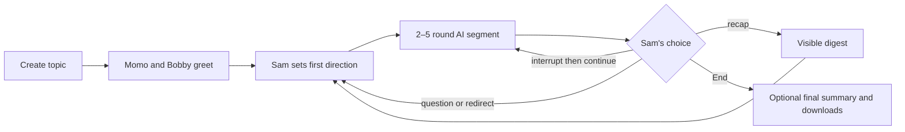
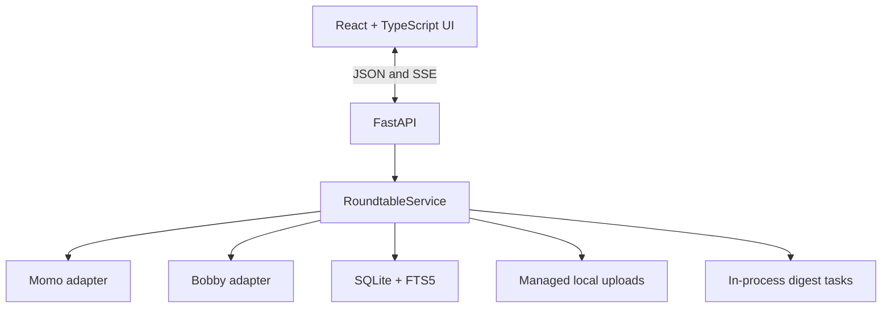

<p align="center">
  
</p>

# Academic Roundtable

Academic Roundtable is a local-first web application where two configurable LLM participants—**Momo** and **Bobby**—hold an interruptible academic discussion while **Sam** acts as host, learner, participant, and judge.

Its guiding principle is **deep conversations for better learning**. The AIs debate in concise, readable turns; Sam can question, redirect, interrupt, request a recap, or let them continue for another bounded segment.

> Status: audited lean MVP for local learning pilots. It is not yet designed for public hosting or multiple users.

> **Development baseline:** This `academic-roundtable-github-ready` copy is the canonical workspace for all future development, testing, documentation, and GitHub preparation. The earlier working folder is retained only as a historical source snapshot.

## Why this project

Ordinary multi-agent chats tend to become long parallel monologues. Academic Roundtable instead treats focus, human authority, and readable disagreement as system behavior:

- Momo and Bobby respond to Sam and engage each other's claims.
- AI-only discussion is limited to two to five rounds at a time.
- Sam can interrupt at any moment without losing already streamed text.
- Live turns use the Topic Digest, latest Conversation Digest, active question, and five recent rounds.
- Uploaded sources can ground the discussion, while allowed model knowledge is labeled as background knowledge.
- Full transcripts and digest history remain available for final synthesis and download.
- After summary processing ends, Sam can evaluate learning directly on the closeout page; the saved rubric and diagnostics are included in session downloads.

## Core workflow



## Features

- Two independently configured OpenAI-compatible model servers
- Responses API and Chat Completions adapter styles
- Streamed, interruptible Momo/Bobby discussion segments
- Direct routing with `@momo`, `@bobby`, or participant names
- Random first respondent for undirected Sam messages
- Independent first answers when both AIs are addressed
- Concise agree/disagree/qualify/extend academic turns
- Scheduled invitations to Sam and **Let them continue** when Sam defers
- Natural-language and button-triggered recaps
- Topic, conversation, periodic, requested, and final digests
- At least five recent complete rounds in every live model request
- PDF, TXT, and Markdown upload, extraction, digestion, and FTS5 retrieval
- Sources-only mode or labeled internal background knowledge
- Conversation-first rolling interface with persistent host controls
- Provider health and background-job progress
- Markdown, JSON, and ZIP session exports after closure
- An **End** action that interrupts generation and opens closeout immediately
- Cancellable final-summary generation; downloads remain available without it
- Single-session local retention with a protected download handoff

## Architecture



The compiled Vite frontend is served by FastAPI for a one-process local deployment. SQLite stores sessions, messages, rounds, documents, jobs, and append-only digest history. Full implementation details are in [docs/SYSTEM-SUMMARY.md](docs/SYSTEM-SUMMARY.md).

## Requirements

- Python 3.11 or newer
- Node.js 20.19+ or 22.12+
- pnpm 9+ recommended
- One or two OpenAI-compatible provider credentials

The two participants may use the same server during development, but separate configurations are supported.

## Quick start on Windows

From the project root in PowerShell:

```powershell
powershell -ExecutionPolicy Bypass -File .\scripts\setup.ps1
Copy-Item .env.example .env.local
# Edit .env.local and add provider settings and key environment-variable names.
powershell -ExecutionPolicy Bypass -File .\run.ps1
```

Open [http://127.0.0.1:8765](http://127.0.0.1:8765). Interactive API documentation is available at [http://127.0.0.1:8765/docs](http://127.0.0.1:8765/docs).

Never place a real credential in `.env.example` or commit `.env.local`.

## Provider configuration

`.env.local` can configure each participant independently:

```dotenv
# Add secrets only in your ignored local copy.
OPENAI_API_KEY=
BOBBY_API_KEY=

MOMO_BASE_URL=https://api.openai.com/v1
MOMO_MODEL=your-momo-model-id
MOMO_API_STYLE=responses
MOMO_API_KEY_ENV=OPENAI_API_KEY
MOMO_REASONING_EFFORT=low

BOBBY_BASE_URL=https://your-compatible-server.example/v1
BOBBY_MODEL=your-bobby-model-id
BOBBY_API_STYLE=chat_completions
BOBBY_API_KEY_ENV=BOBBY_API_KEY
BOBBY_REASONING_EFFORT=low
```

`MOMO_API_KEY_ENV` and `BOBBY_API_KEY_ENV` contain the **names** of environment variables, not the secrets themselves. Supported API styles are `responses` and `chat_completions`.

Check connectivity without displaying credentials:

```powershell
.\.venv\Scripts\python.exe .\scripts\check_providers.py
```

## Development

Install dependencies:

```powershell
python -m venv .venv
.\.venv\Scripts\python.exe -m pip install -r requirements.txt
Set-Location frontend
pnpm install --frozen-lockfile
Set-Location ..
```

Run the backend:

```powershell
$env:PYTHONPATH='backend'
.\.venv\Scripts\python.exe -m uvicorn app.main:app --app-dir backend --reload --port 8765
```

Run the frontend in a second terminal:

```powershell
Set-Location frontend
pnpm dev
```

The Vite server proxies `/api` to FastAPI.

## Verification

Backend tests:

```powershell
$env:PYTHONPATH='backend'
.\.venv\Scripts\python.exe -m pytest backend\tests -q
```

Frontend production build:

```powershell
Set-Location frontend
pnpm build
```

Optional live-provider smoke test (uses API capacity):

```powershell
.\.venv\Scripts\python.exe .\scripts\smoke_generation.py
```

The current deterministic backend suite contains 24 passing tests. The built-in learning-quality workflow and optional developer comparison tools are documented in [docs/LEARNING-QUALITY-EVALUATION.md](docs/LEARNING-QUALITY-EVALUATION.md). See [docs/CRITICAL-REVIEW.md](docs/CRITICAL-REVIEW.md) for the prioritized agent-system review and [docs/INDEPENDENT-AUDIT.md](docs/INDEPENDENT-AUDIT.md) for the broader audit.

## Conversation memory

Every live turn receives:

1. The participant persona and concise academic-conversation protocol
2. Sam's latest direction and the active question
3. The Topic Digest
4. Only the most recent Conversation Digest
5. At least five recent complete rounds
6. Relevant retrieved source passages

The complete transcript and all prior digest versions remain in SQLite. They are used for the final summary and exports but are not repeatedly sent to providers during live discussion.

## Session lifecycle and retention

The application intentionally retains one session at a time:

1. Sam concludes the current session.
2. The active stream finishes cancelling and the closeout page starts an optional final summary.
3. Sam may wait for the summary, cancel it, or skip directly to the next-table action.
4. Once summary processing ends, Sam may complete and save the built-in learning evaluation.
5. The closeout page offers Markdown, JSON, and ZIP downloads, including any saved evaluation, even when the summary is cancelled.
6. If the record has not been saved—or the summary was skipped—the app asks whether Sam wants to stay for optional save/evaluation work.
7. Selecting **No, start new roundtable** immediately clears prior database history, evaluation, FTS passages, and managed uploads before showing the new-table form.

Download the ZIP archive before starting a new session if the source files and full record should be kept.

## Runtime data

Default local state lives under `data/`:

```text
data/
├── roundtable.sqlite3
└── uploads/
```

Runtime data, uploads, databases, environment files, logs, dependency directories, and build outputs are ignored by Git.

## API overview

| Method | Endpoint | Purpose |
|---|---|---|
| `GET` | `/api/health` | Application and provider health |
| `GET/POST` | `/api/sessions` | List or create the single retained session |
| `GET/PATCH` | `/api/sessions/{id}` | Read or update session settings |
| `POST` | `/api/sessions/{id}/messages` | Add Sam's message and determine the next action |
| `POST` | `/api/sessions/{id}/segments` | Stream a bounded AI segment over SSE |
| `POST` | `/api/sessions/{id}/interrupt` | Interrupt active generation |
| `POST` | `/api/sessions/{id}/recap` | Request a conversation digest |
| `POST` | `/api/sessions/{id}/documents` | Upload and schedule source digestion |
| `GET` | `/api/sessions/{id}/jobs` | Inspect session background jobs |
| `GET/PUT` | `/api/sessions/{id}/learning-evaluation` | Open or save the session-scoped learning evaluation |
| `GET` | `/api/sessions/{id}/export` | Download Markdown, JSON, or ZIP after closure |

## Project structure

```text
academic-roundtable/
├── backend/
│   ├── app/                 # API, orchestration, adapters, prompts, DB, documents
│   └── tests/               # deterministic backend tests
├── docs/
│   ├── SYSTEM-SUMMARY.md
│   ├── IMPLEMENTATION-PLAN.md
│   ├── INDEPENDENT-AUDIT.md
│   ├── CRITICAL-REVIEW.md
│   ├── LEARNING-QUALITY-EVALUATION.md
│   ├── DEVELOPMENT.md
│   └── GITHUB-RELEASE-CHECKLIST.md
├── evaluation/
│   └── fixtures/            # repeatable learning-quality pilot scenarios
├── frontend/
│   ├── public/              # logo
│   └── src/                 # React UI and API client
├── scripts/                 # setup, provider check, live smoke test
├── .github/workflows/       # backend, frontend, and secret-tracking CI checks
├── CONTRIBUTING.md
├── SECURITY.md
├── .env.example
├── requirements.txt
└── run.ps1
```

## Security and privacy

The local MVP keeps credentials server-side, omits internal upload paths from public API objects, validates managed-file paths before deletion/archive, and treats uploaded text as untrusted evidence. It does not print API keys during its provider check.

This is not sufficient for public hosting. Before remote deployment, add authentication and authorization, per-user isolation, request and rate limits, malware scanning, stricter file validation, HTTPS, secure secret management, security headers, monitoring, and a retention policy.

Before publishing the repository, run a secret scan over both the working tree and Git history.

## Current limitations

- Single local user and one retained session
- No automatic restart/resume for interrupted background jobs
- No provider retry or circuit-breaker layer
- FTS5 lexical retrieval only
- No OCR for scanned image-only PDFs
- English-pattern detection for recap and closing intents
- No formal claim graph, scoring dashboard, voice mode, or autonomous web research
- No license selected yet; choose one before public distribution or outside contributions

The prioritized next increments are in [docs/IMPLEMENTATION-PLAN.md](docs/IMPLEMENTATION-PLAN.md). Repository preparation steps are in [docs/GITHUB-RELEASE-CHECKLIST.md](docs/GITHUB-RELEASE-CHECKLIST.md).

## Contributing

See [CONTRIBUTING.md](CONTRIBUTING.md) and the [development and testing guide](docs/DEVELOPMENT.md). Security reports should follow [SECURITY.md](SECURITY.md).

Before proposing a change:

1. Keep the conversation-first interface and human-control guarantees intact.
2. Add deterministic coverage for scheduler, lifecycle, persistence, or API behavior changes.
3. Run backend tests and the frontend production build.
4. Do not commit credentials, transcripts, uploaded sources, runtime databases, or generated build artifacts.
5. Update the system summary when behavior or architecture changes.

## License

No license has been selected yet. Add an explicit license before distributing the project publicly or accepting external contributions.
