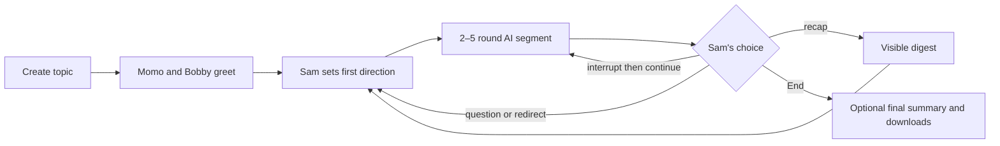
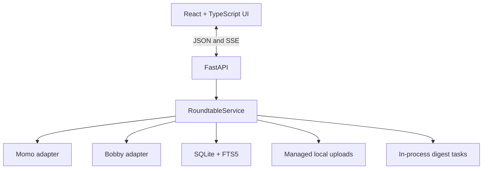

<p align="center">
  
</p>

# Academic Roundtable

Academic Roundtable is a local-first web application where two configurable LLM participants—**Momo** and **Bobby**—hold an interruptible academic discussion while **Sam** acts as host, learner, participant, and judge.

Its guiding principle is **deep conversations for better learning**. The AIs debate in concise, readable turns; Sam can question, redirect, interrupt, request a recap, or let them continue for another bounded segment.

> Status: audited lean MVP for local learning pilots. It is not yet designed for public hosting or multiple users.

> **Development baseline:** This `academic-roundtable-github-ready` copy is the canonical workspace for all future development, testing, documentation, and GitHub preparation. The earlier working folder is retained only as a historical source snapshot.

## Why this project

Ordinary multi-agent chats tend to become long parallel monologues. Academic Roundtable instead treats focus, human authority, and readable disagreement as system behavior:

- Bobby develops the strongest defensible case through mechanisms, evidence needs, and integrative explanations; Momo persistently audits Bobby's and Sam's claims for necessary assumptions, evidentiary support, scope, causal interpretation, qualifications, alternatives, and boundary conditions. She preserves what is defensible and identifies the decisive test rather than disagreeing by reflex. Both answer Sam directly and pursue depth without turning concise contributions into mini-essays.
- AI-only discussion is limited to two to five rounds at a time. Automatic mode uses two rounds by default, with an occasional three-round variation; Sam may select an exact fixed length.
- Sam can interrupt at any moment without losing already streamed text.
- Live turns use the Topic Digest, latest Conversation Digest, active question, and five recent rounds.
- Uploaded sources can ground the discussion, while allowed model knowledge is labeled as background knowledge.
- Sam can choose Fast discussion, Research mode, or Verification mode. Research and Verification route live turns and background digests to configured flagship models with medium or high reasoning and larger, longer budgets; the Fast profile remains the low-latency default.
- The AI LLM mode is an explicit button group on both the landing page and conversation page. The conversation control applies to the next segment and is disabled while the AIs are streaming.
- Full transcripts and digest history remain available as inputs to final synthesis and in the complete archive. The closeout Summary Digest contains only Momo's comprehensive synthesized learning record; it does not append the Topic Digest, processed-source digests, current Conversation Digest, or earlier digest history.
- The closeout page shows a highlighted blue status notice while final and one-page summaries are generated. After processing, the save/download row appears first and **Evaluate learning** follows beneath it; saved rubric results are included in later downloads.

## Core workflow



## Features

- Two independently configured model servers (OpenAI-compatible or native Anthropic-compatible)
- Responses API, Chat Completions, and Anthropic Messages adapter styles
- Streamed, interruptible Momo/Bobby discussion segments
- Direct routing with `@momo`, `@bobby`, or participant names
- Random first respondent for undirected Sam messages
- Independent first answers when both AIs are addressed
- Concise agree/disagree/qualify/extend academic turns
- Scheduled invitations to Sam and **Let them continue** when Sam defers
- Natural-language and button-triggered recaps
- Topic, conversation, periodic, requested, and final digests
- The five most recent complete rounds in every live model request
- PDF, TXT, and Markdown upload, extraction, digestion, and FTS5 retrieval
- PDF extraction uses PyMuPDF + pdfplumber for table-aware extraction and figure-object detection cues (pypdf fallback remains for compatibility)
- Sources-only mode or labeled internal background knowledge
- Conversation-first rolling interface with persistent host controls
- Highlighted Sam composer whenever Sam has the floor
- Optional Sam voice input during the human floor, or **Interrupt and speak** during an AI segment; recordings continue until Sam stops them, are transcribed with topic-aware light spelling/punctuation correction, and return to the composer for review and editing before submission
- Highlighted top-right **Sam has the floor** indicator
- Provider health and background-job progress
- Temporary local System cards for active Topic Digest and Conversation Digest work; these disappear on completion and are never stored or exported
- Blue closeout progress messages that distinguish final-summary and one-page-summary processing
- Readable transcript, synthesis-only comprehensive Summary Digest, one-page summary, and complete ZIP archive exports after closure; structured session data and explicit supporting digest files remain inside the archive for machine use
- An **End** action that interrupts generation and opens closeout immediately
- Cancellable final-summary generation; downloads remain available without it
- Single-session local retention with a protected download handoff
- Optional PDF/TXT/Markdown sources can be selected on the landing page; they are uploaded and queued for background digestion immediately after Start, while the greeting screen is already available. The conversation-page evidence library remains available for later additions.

## Architecture



The compiled Vite frontend is served by FastAPI for a one-process local deployment. SQLite stores sessions, messages, rounds, documents, jobs, and append-only digest history. Full implementation details are in [docs/SYSTEM-SUMMARY.md](docs/SYSTEM-SUMMARY.md).

## Requirements

- Python 3.11 or newer
- Node.js 20.19+ or 22.12+
- pnpm 9+ recommended
- One or two provider credentials (OpenAI-compatible or Anthropic)
- PyMuPDF and pdfplumber installed for PDF table/figure handling

The two participants may use the same server during development, but separate configurations are supported.

## Quick start on Windows

From the project root in PowerShell:

```powershell
powershell -ExecutionPolicy Bypass -File .\scripts\setup.ps1
Copy-Item .env.example .env.local
# Edit .env.local and add provider settings and key environment-variable names.
powershell -ExecutionPolicy Bypass -File .\run.ps1
```

Open [http://127.0.0.1:8765](http://127.0.0.1:8765). Interactive API documentation is available at [http://127.0.0.1:8765/docs](http://127.0.0.1:8765/docs).

Never place a real credential in `.env.example` or commit `.env.local`.

## Provider configuration

`.env.local` can configure each participant independently:

```dotenv
# Add secrets only in your ignored local copy.
OPENAI_API_KEY=
GEMINI_API_KEY=
ANTHROPIC_API_KEY=

MOMO_BASE_URL=https://api.openai.com/v1
MOMO_MODEL=your-momo-model-id
MOMO_API_STYLE=responses
MOMO_API_KEY_ENV=OPENAI_API_KEY
MOMO_REASONING_EFFORT=low
MOMO_LIVE_MAX_OUTPUT_TOKENS=800

BOBBY_BASE_URL=https://generativelanguage.googleapis.com/v1beta/openai
BOBBY_MODEL=gemini-3.1-flash-lite
BOBBY_API_STYLE=chat_completions
BOBBY_API_KEY_ENV=GEMINI_API_KEY
BOBBY_REASONING_EFFORT=low
BOBBY_LIVE_MAX_OUTPUT_TOKENS=1400
BOBBY_CONNECT_TIMEOUT_SECONDS=10
BOBBY_FIRST_TOKEN_TIMEOUT_SECONDS=60
BOBBY_STREAM_IDLE_TIMEOUT_SECONDS=60
BOBBY_TOTAL_TIMEOUT_SECONDS=240

# Optional alternative for Bobby (disabled until selected)
# BOBBY_BASE_URL=https://api.anthropic.com/v1
# BOBBY_MODEL=claude-3-5-haiku-20241022
# BOBBY_API_STYLE=anthropic_messages
# BOBBY_API_KEY_ENV=ANTHROPIC_API_KEY

# Longer limits apply to medium-reasoning background synthesis.
DIGEST_PROVIDER=momo
FINAL_SUMMARY_MAX_OUTPUT_TOKENS=6000
DIGEST_SECTION_TIMEOUT_SECONDS=300
DIGEST_JOB_TIMEOUT_SECONDS=900
```

`MOMO_API_KEY_ENV` and `BOBBY_API_KEY_ENV` contain the **names** of environment variables, not the secrets themselves.
Supported API styles are `responses`, `chat_completions`, and `anthropic_messages`.

Reasoning is task-aware. Fast live turns use each participant's configured effort (`low` by default for speed); Research selects the configured flagship pair with medium reasoning; Verification selects the flagship pair with high reasoning and is also activated for an explicit request to check the original source. The UI keeps visible turns concise even when the model allowance grows. Source, topic, conversation, final-summary, and learning-evaluation requests use larger background budgets, with Research and Verification applying additional token and deadline multipliers. Responses and Chat Completions adapters forward model and reasoning overrides, and Anthropic Messages remains available for Bobby. Momo uses an 800-token base live allowance and Bobby uses 1,400 in Fast mode; profile multipliers expand only the selected session. A Chat Completions `finish_reason` of `length` is treated as an interrupted response rather than silent success, and the next AI does not continue from that fragment. Provider timeout variables govern live calls; background digest jobs use their separate section and job deadlines.

### Conversation profiles

The default `.env.example` includes separate model and reasoning settings for the profiles:

- **Fast discussion:** current provider defaults, low reasoning, shortest latency.
- **Research mode:** GPT-5.6 Sol for Momo and Gemini 3.1 Pro Preview for Bobby by default, medium reasoning, approximately 2× live allowances and longer deadlines.
- **Verification mode:** the same flagship pair by default, high reasoning, approximately 2× live allowances and 2.5× live deadlines. Raw PDF/document excerpts are still withheld unless Sam explicitly asks to check the original source.

Use Research or Verification for derivations, statistical model comparisons, sensitivity analysis, disputed claims, or source checks. For numerical work, add a calculator/Python/R verification step; model reasoning does not replace deterministic computation.

Check connectivity without displaying credentials:

```powershell
.\.venv\Scripts\python.exe .\scripts\check_providers.py
```

For an opt-in, end-to-end comparison of all three profiles with an approved local paper:

```powershell
.\.venv\Scripts\python.exe .\scripts\simulate_reasoning_profiles.py --pdf "C:\path\to\approved-paper.pdf" --rounds 2
```

This live script consumes provider capacity, reports actual model/reasoning routing plus latency and output size, and leaves the session open for inspection. It is not run by CI. See [docs/INDEPENDENT-AUDIT.md](docs/INDEPENDENT-AUDIT.md) for the recorded cognitive-trajectories simulation.

## Development

Install dependencies:

```powershell
python -m venv .venv
.\.venv\Scripts\python.exe -m pip install -r requirements.txt
Set-Location frontend
pnpm install --frozen-lockfile
Set-Location ..
```

After backend startup, verify PDF library health:

```powershell
curl http://127.0.0.1:8765/api/documents/dependencies
```

Run the backend:

```powershell
$env:PYTHONPATH='backend'
.\.venv\Scripts\python.exe -m uvicorn app.main:app --app-dir backend --reload --port 8765
```

Run the frontend in a second terminal:

```powershell
Set-Location frontend
pnpm dev
```

The Vite server proxies `/api` to FastAPI.

## Verification

Backend tests:

```powershell
$env:PYTHONPATH='backend'
.\.venv\Scripts\python.exe -m pytest backend\tests -q
```

Frontend production build:

```powershell
Set-Location frontend
pnpm build
```

Optional live-provider smoke test (uses API capacity):

```powershell
.\.venv\Scripts\python.exe .\scripts\smoke_generation.py
.\.venv\Scripts\python.exe .\scripts\smoke_generation.py --participant Bobby
```

The current deterministic backend suite contains 70 passing tests; the frontend suite contains 4 passing tests and the production build is verified. The built-in learning-quality workflow and optional developer comparison tools are documented in [docs/LEARNING-QUALITY-EVALUATION.md](docs/LEARNING-QUALITY-EVALUATION.md). See [docs/CRITICAL-REVIEW.md](docs/CRITICAL-REVIEW.md) for the prioritized agent-system review and [docs/INDEPENDENT-AUDIT.md](docs/INDEPENDENT-AUDIT.md) for the broader audit.

## Conversation memory

Every ordinary live turn receives all four continuity layers—processed document digest, Topic Digest, latest Conversation Digest, and the five most recent completed rounds—along with the active question and participant instructions:

1. The participant persona and concise academic-conversation protocol
2. Sam's latest direction and the active question
3. The Topic Digest
4. Only the most recent Conversation Digest
5. The five most recent complete rounds, including relevant Sam interventions
6. The processed document digest, when an uploaded source is available

The complete transcript and all prior digest versions remain in SQLite. They are used for the final summary and exports but are not repeatedly sent to providers during live discussion.

Raw PDF/document passages are not included in ordinary rounds. If Sam explicitly asks to “check the original source,” “check the original PDF/document,” or otherwise verify a claim against the uploaded material, the next AI segment retrieves up to five relevant indexed passages and sends them as clearly labeled, untrusted original-source excerpts. That verification segment uses the enlarged source-processing token and timeout multipliers. A later Continue action returns to digest-only context unless Sam makes another verification request.

## Session lifecycle and retention

The application intentionally retains one session at a time. Both the interface and direct API creation require explicit reset whenever any prior session record exists, including a closed one:

1. Sam concludes the current session.
2. The active stream finishes cancelling and the closeout page starts an optional final summary.
3. Sam may wait for the summary, cancel it, or skip directly to the next-table action.
4. A blue progress message distinguishes session-material summarization from one-page-summary generation and asks Sam to wait or cancel.
5. Once processing ends, the closeout page presents the complete archive, readable transcript, one-page summary, and comprehensive Summary Digest downloads, followed by the optional learning-evaluation control. The Summary Digest is synthesis-only; download the archive to retain the Topic, source, current Conversation, and historical digest records.
6. Sam may complete and save the built-in learning evaluation; subsequent downloads include it.
7. If the record has not been saved—or the summary was skipped—the app asks whether Sam wants to stay for optional save/evaluation work.
8. Selecting **No, start new roundtable** immediately clears prior database history, evaluation, FTS passages, and managed uploads before showing the new-table form.

Download the ZIP archive before starting a new session if the source files and full record should be kept.

## Runtime data

Default local state lives under `data/`:

```text
data/
├── roundtable.sqlite3
└── uploads/
```

Runtime data, uploads, databases, environment files, logs, dependency directories, and build outputs are ignored by Git.

## API overview

| Method | Endpoint | Purpose |
|---|---|---|
| `GET` | `/api/health` | Application and provider health |
| `GET` | `/api/meta` | Runtime metadata, profile catalog, and PDF dependency summary |
| `GET` | `/api/documents/dependencies` | Confirm PDF extraction dependencies (`pymupdf`, `pdfplumber`) |
| `GET/POST` | `/api/sessions` | List or create the single retained session |
| `GET/PATCH` | `/api/sessions/{id}` | Read or update session settings |
| `POST` | `/api/sessions/{id}/messages` | Add Sam's message and determine the next action |
| `POST` | `/api/sessions/{id}/voice-transcription` | Transcribe a temporary Sam recording into an editable topic-aware draft |
| `POST` | `/api/sessions/{id}/segments` | Stream a bounded AI segment over SSE |
| `POST` | `/api/sessions/{id}/interrupt` | Interrupt active generation |
| `POST` | `/api/sessions/{id}/recap` | Request a conversation digest |
| `POST` | `/api/sessions/{id}/documents` | Upload and schedule source digestion |
| `GET` | `/api/sessions/{id}/jobs` | Inspect session background jobs |
| `GET/PUT` | `/api/sessions/{id}/learning-evaluation` | Open or save the session-scoped learning evaluation |
| `GET` | `/api/sessions/{id}/export` | Download transcript Markdown, Summary Digest, one-page summary, structured JSON, or ZIP after closure |

## Project structure

```text
academic-roundtable/
├── backend/
│   ├── app/                 # API, orchestration, adapters, prompts, DB, documents
│   └── tests/               # deterministic backend tests
├── docs/
│   ├── SYSTEM-SUMMARY.md
│   ├── IMPLEMENTATION-PLAN.md
│   ├── INDEPENDENT-AUDIT.md
│   ├── CRITICAL-REVIEW.md
│   ├── LEARNING-QUALITY-EVALUATION.md
│   ├── DEVELOPMENT.md
│   └── GITHUB-RELEASE-CHECKLIST.md
├── evaluation/
│   └── fixtures/            # repeatable learning-quality pilot scenarios
├── frontend/
│   ├── public/              # logo
│   └── src/                 # React UI and API client
├── scripts/                 # setup, provider check, live smoke test
├── .github/workflows/       # backend, frontend, and secret-tracking CI checks
├── CONTRIBUTING.md
├── SECURITY.md
├── .env.example
├── requirements.txt
└── run.ps1
```

## Security and privacy

The local MVP keeps credentials server-side, omits internal upload paths from public API objects, validates managed-file paths before deletion/archive, and treats uploaded text as untrusted evidence. It does not print API keys during its provider check.

This is not sufficient for public hosting. Before remote deployment, add authentication and authorization, per-user isolation, request and rate limits, malware scanning, stricter file validation, HTTPS, secure secret management, security headers, monitoring, and a retention policy.

Before publishing the repository, run a secret scan over both the working tree and Git history.

## Current limitations

- Single local user and one retained session
- No automatic restart/resume for interrupted background jobs
- No provider retry or circuit-breaker layer
- FTS5 lexical retrieval only
- No OCR for scanned image-only PDFs
- English-pattern detection for recap and closing intents
- No formal claim graph, scoring dashboard, continuous/realtime voice conversation, or autonomous web research
- No license selected yet; choose one before public distribution or outside contributions

## Sam voice input

Voice input uses the configured OpenAI transcription endpoint with `gpt-4o-mini-transcribe` by default. The browser has no recording-time cutoff: Sam can speak for three minutes, five minutes, or longer and stops the recording manually. The in-memory recording is uploaded only after Sam stops. The transcription prompt includes the roundtable topic, active question, and key academic terms so obvious terminology and spelling errors can be corrected without summarizing or strengthening Sam's claims. The returned text is never submitted automatically: Sam reviews and edits it in the normal composer, then selects **Answer**. A provider-compatible audio-size safeguard remains necessary for a single upload; if reached, the captured portion is stopped and transcribed rather than discarded.

The recording is sent to OpenAI for transcription and is not written to the roundtable database, upload directory, transcript, exports, or archive. Only the edited text Sam submits becomes session history. Voice-derived or otherwise long Sam comments may contain up to 24,000 characters and receive 1.5× response-token room, 1.75× first-token/stream-idle/total-turn time, and a larger recent-turn context slot throughout the complete AI segment; visible AI turns remain governed by the concise conversation prompt. Natural-language recaps require an explicit conversational command, so topical phrases such as “statistical summary” do not divert the turn into recap generation.

The prioritized next increments are in [docs/IMPLEMENTATION-PLAN.md](docs/IMPLEMENTATION-PLAN.md). Repository preparation steps are in [docs/GITHUB-RELEASE-CHECKLIST.md](docs/GITHUB-RELEASE-CHECKLIST.md).

## Contributing

See [CONTRIBUTING.md](CONTRIBUTING.md) and the [development and testing guide](docs/DEVELOPMENT.md). Security reports should follow [SECURITY.md](SECURITY.md).

Before proposing a change:

1. Keep the conversation-first interface and human-control guarantees intact.
2. Add deterministic coverage for scheduler, lifecycle, persistence, or API behavior changes.
3. Run backend tests and the frontend production build.
4. Do not commit credentials, transcripts, uploaded sources, runtime databases, or generated build artifacts.
5. Update the system summary when behavior or architecture changes.

## License

No license has been selected yet. Add an explicit license before distributing the project publicly or accepting external contributions.
