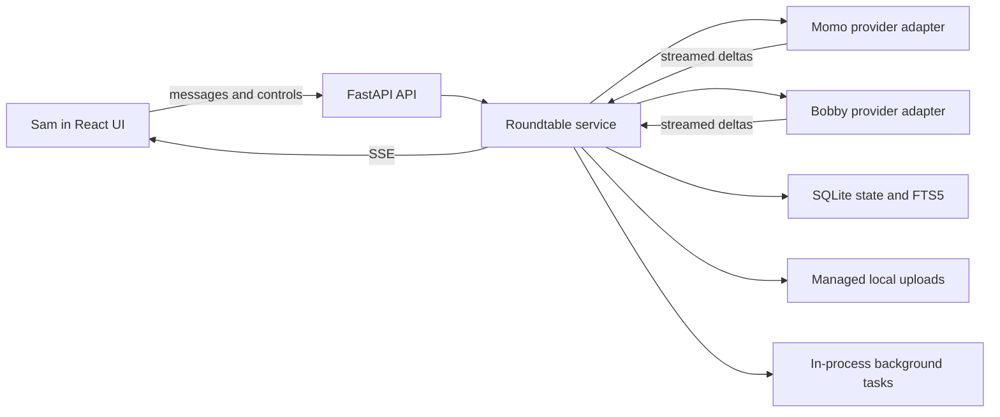

  

# Academic Roundtable: System Summary

Status: audited lean local MVP (`v0.1.0`)  
Last reviewed: 2026-07-20

## Purpose

Academic Roundtable is a web application for **deep conversations for better learning**. Two independently configured LLM participants, **Momo** and **Bobby**, discuss an academic topic while **Sam**, the human user, hosts, learns, challenges claims, redirects the inquiry, and judges the discussion.

The application is deliberately text-first and conversation-first. It does not reuse the architecture or code of the earlier voice-conversation project.

Depth here means intellectual progress—not long answers. Each AI turn should be concise, engage the preceding claim, and make one useful academic move: explain a mechanism, challenge an assumption, distinguish interpretations, examine evidence, qualify a conclusion, or identify the next decisive question.

## Design principles

1. **Human-directed, not human-blocked.** Momo and Bobby may converse for two to five rounds, but Sam can interrupt or redirect them at any time.
2. **Conversation owns the screen.** The rolling transcript is the main interface; Sam's composer and interrupt control remain reachable while generation continues.
3. **Concise turns support depth.** Live prompts target one substantive contribution of roughly 60–110 words rather than comprehensive mini-essays.
4. **Useful opposition.** Each AI must agree, disagree, qualify, or extend the other participant's claim instead of producing parallel monologues.
5. **Focus is durable state.** Every live request includes the Topic Digest, latest Conversation Digest, active question, and at least five recent complete rounds.
6. **Evidence provenance matters.** Source evidence, model background knowledge, inference, and speculation must remain distinguishable.
7. **Documents are evidence, not instructions.** Uploaded text cannot override system behavior or Sam's authority.
8. **Digestion stays off the live path.** Source and summary tasks receive larger budgets and run as background jobs.
9. **Close before replacement.** The current session must be concluded and offered optional download/evaluation choices before a new session can erase it; none of those choices is required.
10. **Lean before scalable.** The first release is a single-user local system; production infrastructure is deferred until the learning experience is validated.

## Participant model

- **Momo** emphasizes explanation, synthesis, mechanisms, and constructive hypotheses.
- **Bobby** emphasizes critique, alternatives, methods, and uncertainty.
- **Sam** supplies the topic and scientific direction, participates in debate, requests recaps, and decides when the session ends.
- **Conversation controller** schedules turns, assembles context, maintains lifecycle state, and coordinates background work. It is not a visible fourth participant.

The roles are tendencies, not authority rankings. Both AIs must respond directly to Sam and to one another.

## User experience

The opening screen collects the topic, learning goal, segment length, evidence policy, and optional documents. After creation, Momo and Bobby each give one short greeting and wait. Greetings are excluded from scientific context and digests. Sam's first substantive message begins the academic discussion.

During a session:

- Sam's message is answered first, then the AIs continue the resulting thread.
- `@momo`, `@bobby`, or a direct name routes the first answer to that participant.
- An undirected message randomly chooses the first respondent.
- Mentioning both AIs requests independent initial answers before ordinary debate resumes.
- AI segments contain two to five rounds, with one contribution from each AI per completed round. Automatic mode chooses two rounds 80% of the time and three rounds 20% of the time; fixed selections remain exact.
- An AI can ask Sam one focused question at a scheduled checkpoint; Sam can answer, redirect, or click **Let them continue**.
- Interrupt stops the active segment without hiding already streamed partial text. Sam may then speak or continue for more rounds.
- Recaps can be requested in natural language or from the interface and appear below the transcript.
- The header **End** action or closing language interrupts generation, creates one brief AI farewell, and opens the download handoff. Final-summary generation can be cancelled without losing transcript or digest downloads.

The transcript uses a fixed-height rolling viewport. New streamed content scrolls inside that viewport rather than moving the whole page, keeping Sam's composer accessible.

## Architecture

### Frontend

React, TypeScript, and Vite provide session setup, the streamed transcript, the always-visible Sam host panel, provider/job status, digests, evidence controls, closeout, and downloads. The production bundle is served by FastAPI.

### API and orchestration

FastAPI exposes session, message, segment, interrupt, recap, document, job, health, and export endpoints. `RoundtableService` serializes generation per session with an asynchronous lock, schedules speakers, assembles prompts, streams provider output, preserves interrupted text, and schedules digest work.

### Provider boundary

Momo and Bobby use separate configuration records and can target different OpenAI-compatible servers. Each adapter supports either the Responses API or Chat Completions style. Provider failures are reported per participant.

Connection, first-token, stream-read, and total-turn timeouts are configured separately. The service explicitly enforces first-token and total-turn deadlines; the HTTP client's read timeout bounds idle streaming. Sam's interrupt also cancels the active stream task immediately, retaining any partial response already received.

### Persistence and retrieval

SQLite stores sessions, rounds, messages, documents, passages, jobs, append-only digest history, and one optional learning evaluation owned by the session. FTS5 supplies lexical passage retrieval. Uploaded PDF, TXT, and Markdown files are stored under the managed data directory; public API views omit internal filesystem paths.

### Background work

Document, topic, conversation, and final-summary synthesis run as in-process asynchronous tasks with persistent job records. Job outcomes survive for inspection, but interrupted work is not automatically resumed after a process restart.

Tasks are owned by their session and are cancelled and awaited before destructive lifecycle changes. Startup reconciliation converts abandoned running work to explicit interrupted/failed states and restores transient sessions to a stable human-floor or closed state.

## Conversation context and memory

Each live request is assembled in this order:

1. Participant persona and concise academic-conversation protocol
2. Evidence policy and current academic move
3. Instruction to answer Sam or engage the preceding substantive claim
4. Latest Topic Digest
5. Latest Conversation Digest only
6. Active question, reflecting Sam's latest direction
7. At least five recent complete rounds, including relevant Sam interventions
8. Up to five retrieved source passages

The complete transcript and full digest history stay in SQLite for final synthesis and export. Older digest history is not sent with each live turn. This keeps context focused and response latency manageable.

Each prompt section also has an explicit input ceiling. Oversized material is visibly clipped for that request while the complete stored record remains unchanged. Retrieved uploads are labeled as untrusted source evidence; provider-specific token estimation is a planned refinement.

## Digestion policy

- A provisional Topic Digest is created from the session topic.
- Uploaded sources trigger page-aware extraction, section digestion, document synthesis, indexing, and Topic Digest refinement.
- Without sources, the Topic Digest develops after several substantive exchanges.
- A Conversation Digest is scheduled every configured five or six completed rounds; Sam's interruptions do not reset that counter.
- Natural-language requests such as “summarize so far” or “let's recap” create an immediate visible digest.
- The final summary draws on the complete digest history plus the most recent substantive turns.
- Source, topic, conversation, and final-summary tasks have larger output budgets than live dialogue.

## Lifecycle and logic flow

```mermaid
stateDiagram-v2
    [*] --> HUMAN_FLOOR: session created and greetings shown
    HUMAN_FLOOR --> AI_SEGMENT_RUNNING: Sam speaks or chooses continue
    AI_SEGMENT_RUNNING --> INTERRUPTING: Sam interrupts or submits a message
    INTERRUPTING --> HUMAN_FLOOR: stream unwinds and partial text is saved
    AI_SEGMENT_RUNNING --> HUMAN_FLOOR: segment or checkpoint completes
    HUMAN_FLOOR --> CLOSING: Sam concludes
    AI_SEGMENT_RUNNING --> CLOSING: Sam concludes during streaming
    CLOSING --> CLOSED: summary completes, fails safely, or Sam cancels it
    CLOSED --> [*]: downloads offered; next session may purge the record
```

Closeout is coordinated with the active generation lock so interrupted text is persisted before the final summary snapshots history. Streaming cleanup cannot overwrite `CLOSING` or `CLOSED`. Sam may cancel summary work; the session then closes with its transcript and existing digests intact. At `CLOSED`, Sam may save a learning evaluation that is included in every export. Downloading, reviewing, and evaluating are optional: when warned about unsaved data, Sam can select **No, start new roundtable** to purge the old session and its evaluation and proceed immediately.

## Functions and features

### Implemented

- Two separately configured LLM participants
- Streamed, bounded, interruptible AI-to-AI segments
- Direct mention routing, random undirected routing, and independent first answers
- Sam-first response logic and host-deferred continuation
- Scheduled human checkpoints
- Concise academic debate prompts and labeled background knowledge
- Topic, conversation, requested, periodic, and final digests
- Five-round raw-history retention in every live request
- PDF/TXT/Markdown upload, extraction, FTS5 retrieval, and source synthesis
- Sources-only mode and model-knowledge fallback mode
- Fixed rolling transcript with visible host controls
- Provider health and background-job progress
- Complete Markdown, JSON, and ZIP exports after closure
- Built-in closeout learning evaluation with automated diagnostics, Sam's evidence-backed rubric, and export inclusion
- Immediate **End**, cancellable final summary, and digest-based wrap-up fallback
- One-session retention with guarded replacement and managed upload cleanup
- Secret loading from ignored local environment files

### Explicit current boundaries

- One local user; no authentication or authorization
- One retained session at a time
- In-process jobs; no restart/resume queue
- Lexical retrieval only; no embeddings or reranking
- Text extraction only; no OCR for scanned PDFs
- No automated retry/circuit-breaker layer
- No formal claim graph, scoring dashboard, voice mode, or web literature search
- No cross-session evaluation history; evaluation data is deleted with its single retained session
- No production deployment, encryption-at-rest layer, or multi-user isolation

## Security and privacy posture

- API keys are read server-side from environment variables and are never returned by the API.
- `.env.local`, runtime data, uploads, databases, logs, build outputs, and work artifacts are ignored by Git.
- Upload filenames are normalized and extensions and size are checked.
- Managed-file deletion and archive inclusion validate paths against the upload root.
- Internal upload paths are removed from all public document responses and exports.
- Source text is treated as untrusted evidence within prompts.

This is still a local MVP, not an internet-facing secure service. Authentication, authorization, request limits, malware scanning, stronger content validation, and deployment hardening are required before remote or multi-user use.

## Quality status

As of the audit date:

- 25 backend tests pass.
- The test suite covers rounds, recent-history retention, mention routing, greeting exclusion, digest history, FTS locators, single-session purging, host-deferred continuation, first-token timeout recovery, immediate stalled-stream cancellation with partial-text retention, restart reconciliation, session-task cancellation, bounded prompt context, close/interrupt lifecycle safety, and final-summary cancellation.
- Frontend type-check and production-build verification is part of the release checklist.
- Live provider checks remain optional because they consume API capacity and depend on external connectivity.

See [LEARNING-QUALITY-EVALUATION.md](LEARNING-QUALITY-EVALUATION.md) for the evaluation harness and pilot process, [CRITICAL-REVIEW.md](CRITICAL-REVIEW.md) for the prioritized agent-system review, [INDEPENDENT-AUDIT.md](INDEPENDENT-AUDIT.md) for the broader audit, and [IMPLEMENTATION-PLAN.md](IMPLEMENTATION-PLAN.md) for the next agile increments.
