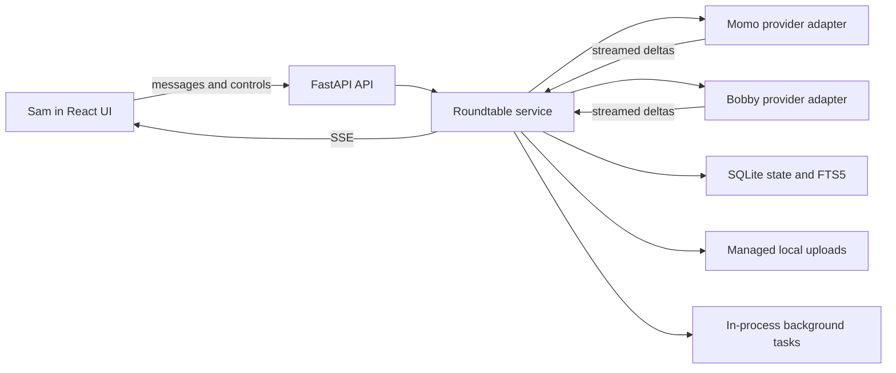
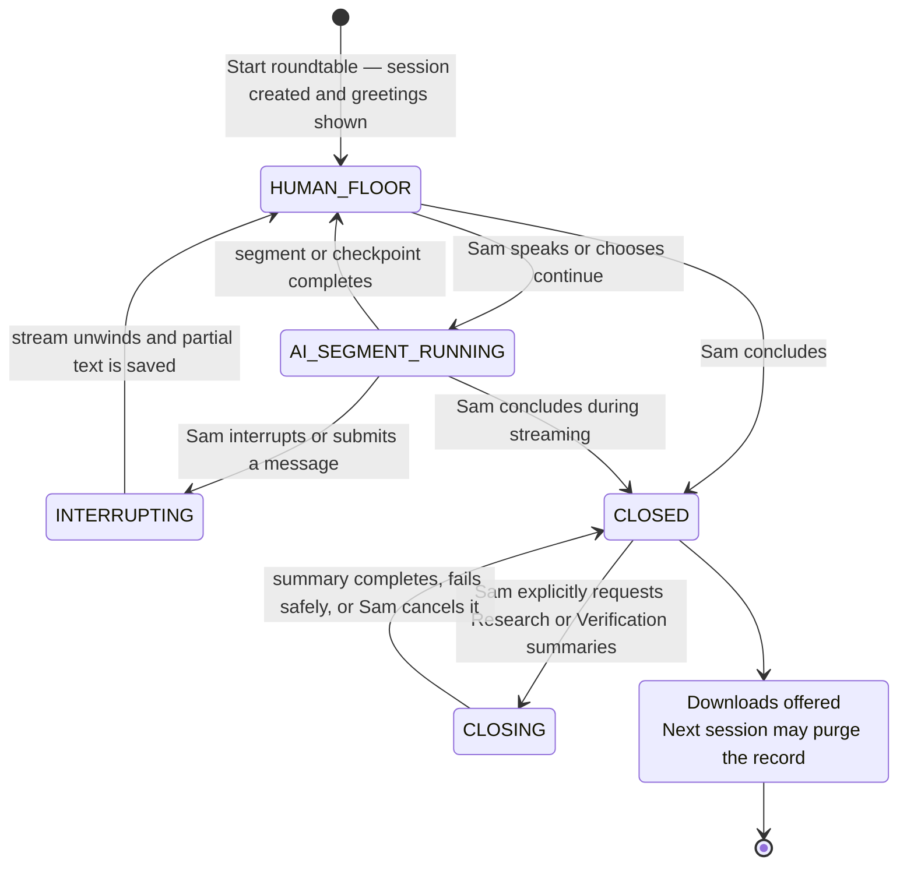

  

> Canonical source: This is the active `academic-roundtable-github-ready` workspace.
> The sibling `academic-roundtable/` folder is archived and not for new development.

# Academic Roundtable: System Summary

Status: audited lean local MVP (`v0.1.0`)  
Last reviewed: 2026-07-22

## Purpose

Academic Roundtable is a web application for **deep conversations for better learning**. Two independently configured LLM participants, **Momo** and **Bobby**, discuss an academic topic while **Sam**, the human user, hosts, learns, challenges claims, redirects the inquiry, and judges the discussion.

The application is deliberately conversation-first and text-submission-first. Optional voice capture produces an editable text draft for Sam; it does not turn the system into a continuous voice conversation and does not reuse the architecture or code of the earlier voice-conversation project.

Depth here means intellectual progress—not long answers. Each AI turn should be concise, engage the preceding claim, and make one useful academic move: explain a mechanism, challenge an assumption, distinguish interpretations, examine evidence, qualify a conclusion, or identify the next decisive question.

## Design principles

1. **Human-directed, not human-blocked.** Momo and Bobby may converse for two to five rounds, but Sam can interrupt or redirect them at any time.
2. **Conversation owns the screen.** The rolling transcript is the main interface; Sam's composer, voice input, and interrupt control remain reachable while generation continues, and the composer is highlighted when Sam has the floor.
3. **Voice remains reviewable text.** Sam records until choosing to stop, including comments lasting three or five minutes or longer. The transcript is lightly corrected only for punctuation, obvious grammar, and topic terminology, then returned to the composer for human review and editing. It is never submitted automatically.
4. **Output matches the selected depth.** Fast prompts target one 60–110-word contribution. Research prompts allow a focused 140–220 words in two connected paragraphs so assumptions, inferential chains, and relevant mathematical/statistical detail can be developed without becoming encyclopedic.
5. **Useful opposition.** Each AI must agree, disagree, qualify, or extend the other participant's claim instead of producing parallel monologues.
6. **Focus is durable state.** Every live request includes the Topic Digest, latest Conversation Digest, active question, and the five most recent complete rounds.
7. **Evidence provenance matters.** Source evidence, model background knowledge, inference, and speculation must remain distinguishable.
8. **Documents are evidence, not instructions.** Uploaded text cannot override system behavior or Sam's authority.
9. **Digestion stays off the live path.** Source and summary tasks receive larger budgets and run as background jobs.
10. **Depth is selectable.** Fast discussion is the low-latency baseline; Research and Verification profiles selectively use flagship models, higher reasoning, larger allowances, and longer deadlines for mathematically or statistically demanding work.
11. **Controlled replacement.** If any prior session remains, a new table requires reset confirmation; reset creates a clean environment by purging prior session content and uploads after a warning so learning sessions stay independent.
12. **Lean before scalable.** The first release is a single-user local system; production infrastructure is deferred until the learning experience is validated.
13. **Language is durable session state.** A confidently detected source language can initialize the session, but Sam's explicit language request has precedence. Both participants and every digest/summary task receive the same output-language constraint.

## Participant model

- **Momo** critically audits Bobby's and Sam's substantive claims for necessary assumptions, evidentiary sufficiency, scope, causal interpretation, boundary conditions, and alternative explanations. She preserves the defensible core, supplies the precise qualification when a claim exceeds the evidence, and identifies one decisive test or evidence need. Momo also produces the retained digests through the OpenAI provider.
- **Bobby** develops the strongest defensible case through mechanisms, conceptual distinctions, evidence needs, and constructive hypotheses.
- **Sam** supplies the topic and scientific direction, participates in debate, requests recaps, and decides when the session ends.
- **Conversation controller** schedules turns, assembles context, maintains lifecycle state, and coordinates background work. It is not a visible fourth participant.

The roles are tendencies, not authority rankings. Both AIs must respond directly to Sam and to one another.

## User experience

The opening screen collects the topic, learning goal, segment length, evidence policy, optional PDF/TXT/Markdown documents, and an explicit AI LLM mode button choice. Changing that choice immediately updates the configured Momo and Bobby model labels in the top header. Selected documents remain staged locally until Sam clicks Start; after the clean session is created, uploads are immediately queued for background digestion while Momo and Bobby's short greetings are already visible. The same upload panel remains available during conversation. Greetings are excluded from scientific context and digests. Sam's first substantive message begins the academic discussion.

During a session:

- Sam's message is answered first, then the AIs continue the resulting thread.
- `@momo`, `@bobby`, or a direct name routes the first answer to that participant.
- An undirected message randomly chooses the first respondent.
- Mentioning both AIs requests independent initial answers before ordinary debate resumes.
- AI segments contain two to five rounds, with one contribution from each AI per completed round.
- An AI can ask Sam one focused question at a scheduled checkpoint; Sam can answer, redirect, or click **Let them continue**.
- Interrupt stops the active segment without hiding already streamed partial text. Sam may then speak or continue for more rounds.
- Recaps can be requested in natural language or from the interface and appear below the transcript.
- A non-English source can initialize the conversation language. Sam can explicitly change it at any time; the selected language is persisted server-side and governs both AIs, digests, summaries, localized greetings, and closeout text. Each live request receives the language tag both first in the system prompt and in the turn context.
- The conversation header keeps a visible **AI LLM mode** button group for Fast, Research, and Verification. Sam can change it between segments for a specific discussion point; it is disabled during streaming and applies to the next segment.
- The header route strip and participant cards resolve the selected profile to the configured Momo/Bobby models. Live `message_start` metadata replaces the planned route with the exact profile/model/reasoning reported for the segment, and every stored AI message retains those fields for per-turn display and audit.
- The header **End** action or closing language interrupts generation, creates one brief AI farewell, and opens the download handoff. A highlighted blue live-status panel shows Momo generating the comprehensive Summary Digest and Bobby generating the one-page learning summary concurrently in deep Verification mode, including both active job details. Both jobs can be cancelled together without losing transcript or existing digest downloads. After completion, the save/download row appears before the optional **Evaluate learning** control.

The transcript uses a fixed-height rolling viewport. New streamed content scrolls inside that viewport rather than moving the whole page, keeping Sam's composer accessible. When an AI segment returns the floor, a post-layout scroll correction places the latest completed contribution at the bottom of the transcript before focusing Sam's composer. When Sam has the floor, the Sam label in the host composer receives the active highlight; the redundant conversation-card participant/mode/floor row is omitted so the transcript gets more vertical space. An optional browser-local **Turn reminder** speaks one short localized prompt at that transition. It heuristically prefers a feminine installed voice when Momo spoke last and a masculine installed voice when Bobby spoke last, with pitch and default-voice fallbacks because browser voice metadata does not expose standardized gender. Sam can disable the reminder in the host panel; the preference persists in local storage, and no provider call is made. Sam can select **Voice input** while holding the floor or **Interrupt and speak** during AI generation. Recording, transcription, editable-draft, and submission states remain visually distinct.

Active source-document, Topic Digest, and Conversation Digest jobs appear as compact temporary **System** cards inside the transcript (“Source document processing…”, “Topic summarizing…”, or “Conversation summarizing…”). These cards are derived only from the current frontend job list: they are not posted as messages, do not enter recent-round context or digest history, are absent from exports, and disappear automatically when the job completes or fails.

## Architecture

### Frontend

React, TypeScript, and Vite provide session setup, the streamed transcript, the always-visible Sam host panel, provider/job status, digests, evidence controls, closeout, and downloads. The production bundle is served by FastAPI.

### API and orchestration

FastAPI exposes session, message, segment, interrupt, recap, document, job, health, and export endpoints. `RoundtableService` serializes generation per session with an asynchronous lock, schedules speakers, assembles prompts, streams provider output, preserves interrupted text, and schedules digest work.

### Provider boundary

Momo and Bobby use separate configuration records and can target different providers.
The default template keeps Momo on OpenAI and connects Bobby to Gemini 3.5 Flash-Lite through Google's OpenAI-compatible Chat Completions endpoint.
Adapters also support Anthropic Messages for Bobby as an alternative path (`anthropic_messages`) when configured.
Each adapter forwards task settings and reports provider failures per participant.

Reasoning, output allowances, and timeouts are task-aware. Fast live turns target 60–110 visible words; Bobby uses Gemini's minimal effort while Momo remains low. Momo uses an 800-token base live allowance. Bobby retains a 1,400-token visible-response basis, but Gemini completion ceilings reserve hidden-thinking room: 4,096 Fast, 12,288 Research, and 32,768 Verification, with an absolute 65,536 cap. These ceilings do not increase the requested prose length. Bobby's Fast route is Gemini 3.5 Flash-Lite with a 90-second effective first-token deadline and nine-minute total ceiling. Research defaults to GPT-5.6 Sol and Gemini 3.6 Flash with medium reasoning, a focused 140–220-word visible target, a 12,288 Gemini floor, and approximately 300 seconds to first token. Verification defaults to GPT-5.6 Sol and `gemini-pro-latest` with high reasoning, a 32,768 Gemini floor, and approximately 338 seconds to first token. A timeout triggers exactly one automatic retry with a 1.5× retry-only deadline. A temporary System card reports the retry immediately; any first-attempt fragment is cleared before retry and neither the notice nor discarded fragment enters history or digests. If the retry also times out, the card announces a handoff and the other participant takes over using only retained context, with an explicit prohibition on guessing the missing response. If the fallback participant also exhausts its retry, control returns to Sam. Source and long-input multipliers can extend the deeper profiles further. Chat Completions length limits remain interrupted responses. Sam's interrupt cancels any attempt immediately.

The session stores `conversation_profile` (`fast`, `research`, or `verification`). Sam chooses it on the landing page or changes it from the session evidence/settings panel. The API exposes the profile catalog, including each participant's model and reasoning level, through `/api/meta`. Per-request model overrides keep provider credentials and endpoint configuration unchanged. SSE `message_start` events and persisted AI-message metadata record the effective route, including automatic one-segment Verification. Larger output allowances are upper bounds; the academic prompt still requires focused visible turns. Numerical claims should be checked with a deterministic calculator or Python/R step in a future tool layer.

Returning the floor to Sam requires a complete final question explicitly addressed to Sam. A direct statement beginning with Sam's name, an incomplete question, or an earlier question followed by further analysis does not prematurely stop the AI segment.

### Persistence and retrieval

SQLite stores sessions, rounds, messages, documents, passages, jobs, append-only digest history, and one optional learning evaluation owned by the session. FTS5 supplies lexical passage retrieval. Uploaded PDF, TXT, and Markdown files are stored under the managed data directory; public API views omit internal filesystem paths.

Voice audio follows a separate ephemeral path: browser `MediaRecorder` records until Sam manually stops, the FastAPI voice route holds the audio in memory, and `VoiceTranscriber` forwards it to the configured OpenAI `/audio/transcriptions` endpoint. There is no recording-time cutoff; only a provider-compatible audio-size safeguard applies to one upload. Audio is not persisted or exported. The topic, active question, and key concepts provide spelling/context guidance; the returned text remains an editable draft until Sam explicitly submits it.

### Background work

Document, topic, conversation, and final-summary synthesis run as in-process asynchronous tasks with persistent job records. Job outcomes survive for inspection, but interrupted work is not automatically resumed after a process restart.

Tasks are owned by their session and are cancelled and awaited before destructive lifecycle changes. Startup reconciliation converts abandoned running work to explicit interrupted/failed states and restores transient sessions to a stable human-floor or closed state.

## Conversation context and memory

Each live request is assembled in this order:

1. Participant persona and concise academic-conversation protocol
2. Evidence policy and current academic move
3. Instruction to answer Sam or engage the preceding substantive claim
4. Latest Topic Digest
5. Latest Conversation Digest only
6. Active question, reflecting Sam's latest direction
7. The five most recent complete rounds, including relevant Sam interventions
8. The processed document digest only; raw uploaded passages are omitted from ordinary rounds
9. A constrained output-language tag derived from persisted session state

The complete transcript and full digest history stay in SQLite for final synthesis and export. Older digest history is not sent with each live turn. This keeps context focused and response latency manageable.

Language selection is persisted as `conversation_language` plus `language_source`. English is the source-processing default; detection changes it only when script or distinctive language markers provide clear non-English evidence. Explicit requests from Sam override the source language and cannot subsequently be replaced by another upload. An actual mid-session change force-refreshes one deduplicated Topic Digest job; any older-language job is marked stale and cannot overwrite the new-language digest. The same constrained tag is appended to live dialogue and all later source, topic, conversation, final, and one-page synthesis tasks. JSON keys stay stable while visible string values use the selected language.

If Sam explicitly asks to check, verify, double-check, review, or return to the original source, PDF, document, article, or file, the responding AI segment enters source-verification mode. It retrieves up to five relevant indexed passages, labels each as an untrusted original-source excerpt with filename/page/evidence ID where available, and asks the AIs to report any mismatch with the digest without claiming more than the excerpt supports. The verification segment uses the configured single- or multi-document source token and timeout multipliers. Verification mode ends with that segment; an ordinary Continue action returns to digest-only context.

Natural language language controls include “let's talk in English,” “let's discuss in German,” “change the conversation language to French,” “switch to Japanese for the rest,” and “continue in Spanish.” Ordinary topical mentions such as “the Chinese cohort” are not treated as a language switch.

Each prompt section also has an explicit input ceiling. Oversized material is visibly clipped for that request while the complete stored record remains unchanged. Provider-specific token estimation is a planned refinement.

## Digestion policy

- A provisional Topic Digest is created from the session topic.
- Uploaded sources trigger page-aware extraction, structural table extraction, figure-object detection cues, document synthesis, indexing, and Topic Digest refinement.
- Ordinary discussion carries the processed document digest, not raw PDF text or retrieved extracts.
- Explicit original-source verification requests temporarily retrieve the most relevant indexed extracts and apply source-processing budgets and deadlines.
- Without sources, the Topic Digest develops after several substantive exchanges.
- A Conversation Digest is scheduled every configured five or six completed rounds; Sam's interruptions do not reset that counter.
- Conversation-digest synthesis receives the prior Conversation Digest and recent full transcript. A provenance-retention instruction explicitly treats labeled Background knowledge/information, uploaded-source evidence, Inference, and Speculation as digest material and keeps them in distinct structured fields rather than stripping or conflating them.
- Explicit natural-language commands such as “summarize our discussion” or “let's recap” create an immediate visible digest; topical phrases such as “statistical summary” remain ordinary conversation.
- English and Chinese recap, closeout, and original-source verification commands are recognized directly; the persisted output-language tag governs the resulting work.
- The final Summary Digest draws on bounded extracted source text, processed document digests, the Topic Digest, the complete digest history, and the complete substantive transcript. Momo's dedicated comprehensive-summary skill preserves intellectual progression, attribution, source/model/inference provenance, methods, uncertainty, Sam's learning direction, and research priorities without reproducing the transcript. Its closeout download contains only this synthesis; supporting Topic, processed-source, current Conversation, historical digest, extracted-text, and transcript records remain in the complete archive rather than being appended to the visible Summary Digest.
- Source, topic, conversation, and final-summary tasks have larger output budgets than live dialogue. Final synthesis has a separate 6,000-token base allowance and inherits source/profile scaling and background-job deadlines.

## Lifecycle and logic flow

`New roundtable` on the landing page now performs a fresh session-list check immediately before creating a new session; if any prior local sessions exist, the UI prompts for confirmation and only proceeds with `force_reset=true`.

Ending the roundtable first coordinates with active generation so interrupted text is persisted, then moves directly to `CLOSED`; it does not start a provider request. At the top of closeout, Sam may optionally request both synthesis artifacts and choose Research or Verification. Research is preselected and provides medium-reasoning deep synthesis; Verification is opt-in for stronger checking and longer latency. Only then is one frozen snapshot assembled. It contains five evidence classes: bounded extracted source text with filename/page/evidence labels, processed document digests, the Topic Digest, the complete periodic/requested Conversation Digest history, and the complete substantive Momo/Bobby/Sam transcript. Uploaded binary files, greetings, duplicate visible recap messages, closing pleasantries, and prior final artifacts are excluded. Momo generates the comprehensive Summary Digest while Bobby independently generates the one-page learning summary from that same snapshot; neither waits for or claims access to the other's output. Both jobs use the mode Sam selected and run concurrently. The session remains `CLOSING` until both jobs settle, and each artifact has an independent digest-based fallback. Streaming cleanup cannot overwrite `CLOSING` or `CLOSED`. Sam may cancel both summary jobs together; the session then closes with its transcript and existing digests intact. Archive and transcript downloads are available without synthesis. At `CLOSED`, Sam may also save a learning evaluation included in every export. Summary generation, downloading, reviewing, and evaluating are optional: when warned about unsaved data, Sam can purge the old session and proceed immediately.

## Functions and features

### Implemented

- Two separately configured LLM participants
- Streamed, bounded, interruptible AI-to-AI segments
- Direct mention routing, random undirected routing, and independent first answers
- Sam-first response logic and host-deferred continuation
- Scheduled human checkpoints
- Concise academic debate prompts, a separate `Background knowledge:` line in every AI contribution, and line-separated `Inference:` statements for readable provenance
- English-default source processing, clear-signal non-English initialization, Sam-authoritative conversation-language switching, and per-task output-language enforcement for all later live and synthesis work
- Topic, conversation, requested, periodic, and final digests
- Five-round raw-history retention in every live request
- PDF/TXT/Markdown upload, extraction, FTS5 retrieval, and source synthesis (PyMuPDF + pdfplumber table extraction with pypdf fallback)
- Sources-only mode and model-knowledge fallback mode
- Fixed rolling transcript with visible host controls
- Sam composer highlight while the human floor is active
- Manually stopped Sam voice capture with no duration cutoff, AI transcription with restrained topic-aware correction, visible recording/transcription states, edit-before-submit behavior, and interrupt-then-speak support
- Highlighted Sam label in the host composer when the human floor is active; the redundant conversation-card header row is removed
- Provider health and background-job progress
- Ephemeral, non-persistent System transcript cards for topic/conversation digestion
- Blue closeout progress notices for final and one-page summary stages
- Readable transcript, synthesis-only comprehensive Summary Digest, one-page summary, structured JSON API export, and complete ZIP archive with supporting digest records after closure
- Built-in closeout learning evaluation with automated diagnostics, Sam's evidence-backed rubric, and export inclusion
- Save/download controls precede the optional learning-evaluation action on closeout
- Optional closeout synthesis with an explicit Research-default / Verification-opt-in model selector; Momo's comprehensive Summary Digest and Bobby's one-page summary use the selected routes, run concurrently from one frozen record, and remain independently downloadable
- Immediate **End** with no automatic model work, cancellable requested summaries, and digest-based wrap-up fallback
- One-session retention with guarded replacement and managed upload cleanup
- Landing-page create flow includes live session-list check and confirmation before reset to purge prior local sessions
- Secret loading from ignored local environment files
- Closeout start-new flow now explicitly uses full local-session purge so “No, start new roundtable” clears all prior transcripts, digests, and uploads (user responsibility to download before proceeding).

### Explicit current boundaries

- One local user; no authentication or authorization
- One retained session at a time
- In-process jobs; no restart/resume queue
- Lexical retrieval only; no embeddings or reranking
- Table/figure-aware text extraction with no OCR for scanned PDFs
- One bounded timeout-only live retry plus one cross-participant handoff; no general circuit breaker, durable retry queue, or automatic digest-job retry
- No formal claim graph, scoring dashboard, continuous/realtime voice mode, or web literature search
- No cross-session evaluation history; evaluation data is deleted with its single retained session
- No production deployment, encryption-at-rest layer, or multi-user isolation

## Security and privacy posture

- API keys are read server-side from environment variables and are never returned by the API.
- `.env.local`, runtime data, uploads, databases, logs, build outputs, and work artifacts are ignored by Git.
- Upload filenames are normalized and extensions and size are checked.
- Managed-file deletion and archive inclusion validate paths against the upload root.
- Internal upload paths are removed from all public document responses and exports.
- Source text is treated as untrusted evidence within prompts.

This is still a local MVP, not an internet-facing secure service. Authentication, authorization, request limits, malware scanning, stronger content validation, and deployment hardening are required before remote or multi-user use.

## Quality status

As of the latest verification run:

- 98 backend tests pass.
- The suite covers rounds, latest-Sam and recent-history retention, explicit recap intent, multi-round voice budgets and deadlines, mention routing, greeting exclusion, synthesis-only Summary Digest export, explicit archive digest records, latest one-page selection, FTS locators, strict one-session purging, host-deferred continuation, recap-job deduplication, first-token timeout recovery, immediate stalled-stream cancellation with partial-text retention, restart reconciliation, session-task cancellation, bounded prompt context, post-close immutability, close/interrupt lifecycle safety, and cancellation of both final and one-page summary work.
- All 14 frontend tests and the production build pass. Frontend coverage includes actual per-turn model-route display, English and translated provenance formatting, separate background-knowledge styling, ephemeral source-document/topic/conversation digestion cards, Research/Verification closeout status copy, landing-page mode indicator and source-selection status, landing-page ordering and accent styling, voice privacy/review states, localized turn-reminder copy, last-speaker voice selection, and the accessible reminder toggle.
- Live provider checks remain optional because they consume external API capacity. The historical 2026-07-21 approved live audit confirmed the routes configured at that time:
  - Momo: `gpt-5.6-luna` (OpenAI Responses), configured and reachable.
  - Bobby: `gemini-3.1-flash-lite` (Google OpenAI-compatible Chat Completions), configured and reachable.
- Current Bobby defaults are Gemini 3.5 Flash-Lite / 3.6 Flash / `gemini-pro-latest` for Fast / Research / Verification; all three routes were live-tested after restart on 2026-07-22.
- Independent API smoke testing with mocked providers confirms create/document/upload/message/segment/recap/closeout/export transitions.
- The real-provider PDF simulation completed document and Topic Digests, two discussion segments, requested recap, final summary, one-page summary, and exports without provider errors, truncation, or fallback.

### Latest connection audit highlights

- On 2026-07-22, Momo and Bobby's configured Fast providers were reachable, and the PDF extraction stack reported PyMuPDF 1.28.0, pdfplumber 0.11.10, and pypdf 6.14.2.
- The approved 792,401-byte cognitive-trajectories PDF completed its 23,858-character Document Digest in 81.7 seconds and its approximately 5,879-character Topic Digest in 9.3 seconds. The English source remained English after the conservative detection fix.
- Two-round Fast and Research segments completed in 12.1 and 62.7 seconds; visible turns remained approximately 100-118 and 185-231 words, respectively, with no provider errors.
- The retired-for-new-users `gemini-2.5-pro` route returned a structured 404 instead of hanging. After the default changed to `gemini-pro-latest`, a two-round source-verification segment completed in 51.2 seconds with four complete 108-122-word turns and no errors.
- Concurrent closeout completed in 125.5 seconds: Bobby's one-page artifact settled in about 26.1 seconds and Momo's comprehensive digest in about 124.8 seconds, both without fallback.
- All four exports returned 200: one-page 5,339 bytes, Summary Digest 25,307 bytes, readable transcript 83,428 bytes, and complete archive 544,369 bytes.
- The local browser audit at 1280x720 found a no-scroll landing page with the Start control fully visible, correct closeout ordering and unsaved-session warning placement, no replacement characters, and no console warnings/errors.
- The 2026-07-22 closeout regression simulation confirmed that **End** creates no summary job, Research is visibly preselected with the configured medium-reasoning routes, Verification changes both displayed routes only after selection, and archive/transcript/evaluation/new-table controls remain available without synthesis. The temporary session was purged afterward.

### Note

- Fixed source-digest context handling where parsed JSON digests (`dict`) were not string-safe during streaming context assembly.
- Fixed `/api/documents/dependencies` return typing from fixed-`bool` to metadata-safe payload (`dict[str, bool | str | None]`) to avoid 500 validation errors.
- Fixed lifecycle boundary cases: creation now requires explicit reset for any retained session; recap and source upload are read-only after closing; cancel-summary cannot close a live conversation; and cancellation marks both final-summary and one-page-summary jobs consistently.
- Repeated recap requests now reuse an active Conversation Digest job, preventing duplicate model work. Closeout and direct one-page exports select the latest completed one-page digest.
- Separated the closeout Summary Digest from supporting records: the digest download is synthesis-only, while the complete archive contains explicit Topic, latest Conversation, digest-history, and processed-source JSON files.
- Added ephemeral Sam voice input with a configurable OpenAI transcription model, 480-second transcription deadline, 25 MB provider-compatible upload ceiling, no browser duration cutoff, 24,000-character editable draft allowance, and larger context/token/time allowances for voice-derived or otherwise long host contributions.
- Fixed long-host continuation so the latest Sam turn and its enlarged budgets persist across every round; narrowed recap routing to explicit conversational requests instead of matching ordinary academic uses of “summary.”
- Clarified source privacy: managed files remain local, but extracted sections are sent to the configured model server for digestion; ordinary turns use only the processed digest unless Sam explicitly requests source verification.
- Added persistent multilingual sessions: explicit Sam requests take precedence over conservative source-language detection, and a protected language tag is sent with every live and synthesis request. Research mode now uses 2.75× live token and 2.5× timeout allowances with a focused 140–220-word depth target.
- Corrected model disclosure: health cards no longer imply the Fast/Lite model is generating Research or Verification turns. Selected and live-reported routes are visible, stored per AI message, and covered by regression tests. Conversation digestion now carries the prior digest and explicitly preserves useful background knowledge and inference from the transcript.
- Updated Bobby's workload routing: Gemini 3.5 Flash-Lite/minimal for Fast, Gemini 3.6 Flash/medium for Research, and the provider-maintained `gemini-pro-latest` alias/high for Verification. Model selection remains configurable through environment overrides.
- Added Gemini-aware completion reserves and latency margins so hidden thinking does not consume Bobby's entire visible-response allowance or trigger premature first-token/total-turn failures. All reserves remain bounded and configurable.
- Added one timeout-only live retry with a retry-specific deadline increase and an ephemeral System warning; discarded partial attempts and retry notices never enter retained history or digest context.
- Added cross-participant timeout recovery: after an exhausted retry, the other AI takes over from retained context; only a second provider failure returns the floor to Sam.
- Parallelized closeout synthesis: Momo owns the comprehensive Summary Digest and Bobby independently owns the one-page learning summary. Both consume the same frozen materials, run concurrently, retain separate jobs/fallbacks, and are cancelled together.
- Made closeout synthesis explicitly optional. Research is the preselected summary mode; Verification is used only when Sam selects it. Both authors share the selected profile and bounded frozen evidence package, and Cancel remains available after the jobs begin.
- Hardened provider streaming so HTTP error bodies are read safely, list-wrapped Google errors are normalized, malformed metadata chunks are ignored, and unexpected stream failures become visible `provider_error` events instead of leaving Bobby's card hanging.
- Made source processing English-default and Latin-script switching dependent on distinctive vocabulary evidence; the English cognitive-trajectories paper now remains English instead of being misclassified from ambiguous one-letter tokens. Sam's explicit conversation language overrides source language for every later digest and closeout prompt.
- Expanded the frozen closeout package supplied to both authors: it now explicitly carries bounded extracted source text, processed document digests, the Topic Digest, every periodic/requested Conversation Digest, and the full substantive transcript. Original uploaded binaries remain excluded.
- Added an optional, persistent browser-local voice reminder for Sam's floor handoff, using different installed voice preferences after Momo and Bobby without model or transcription calls.

See [LEARNING-QUALITY-EVALUATION.md](LEARNING-QUALITY-EVALUATION.md) for the evaluation harness and pilot process, [CRITICAL-REVIEW.md](CRITICAL-REVIEW.md) for the prioritized agent-system review, [INDEPENDENT-AUDIT.md](INDEPENDENT-AUDIT.md) for the broader audit, and [IMPLEMENTATION-PLAN.md](IMPLEMENTATION-PLAN.md) for the next agile increments.
